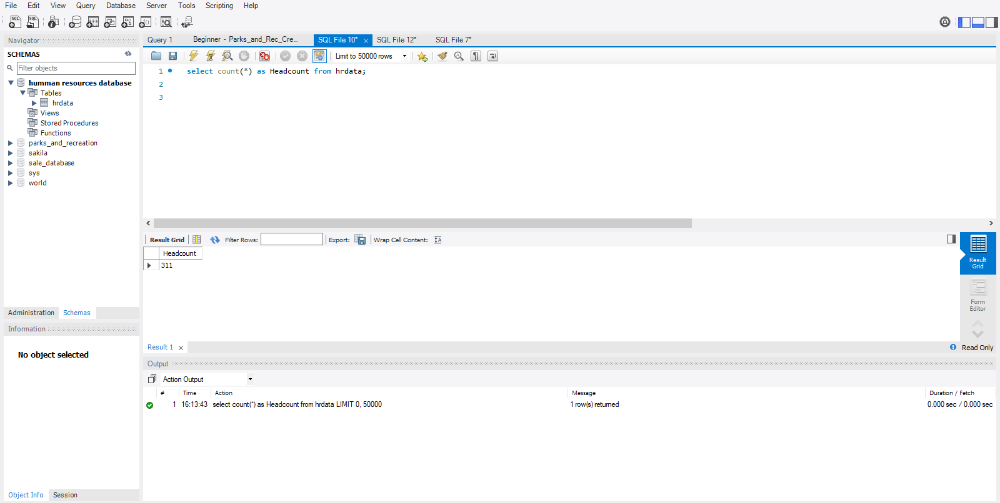
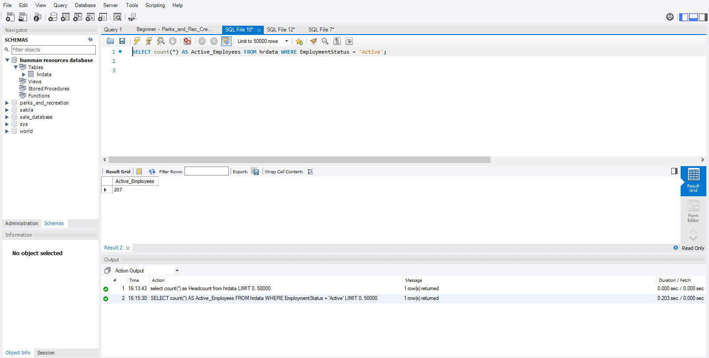
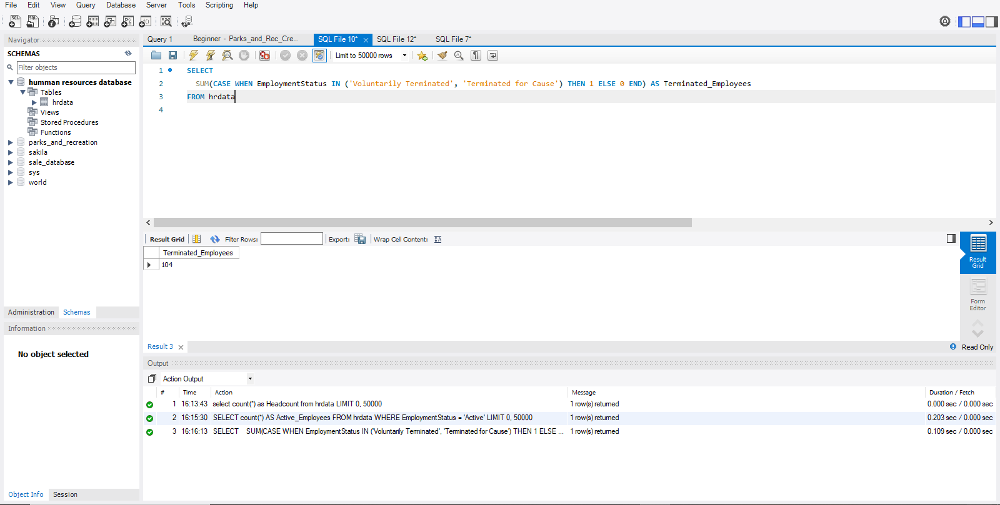
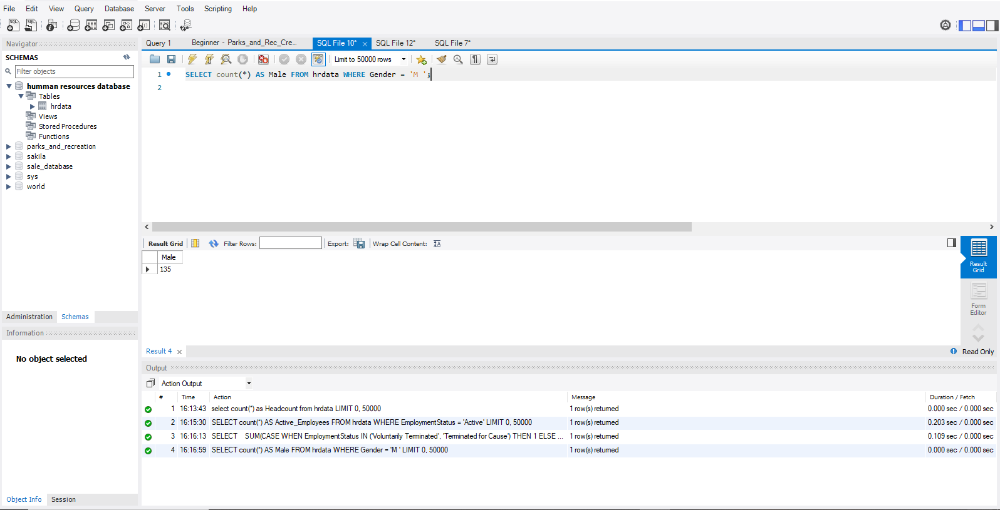
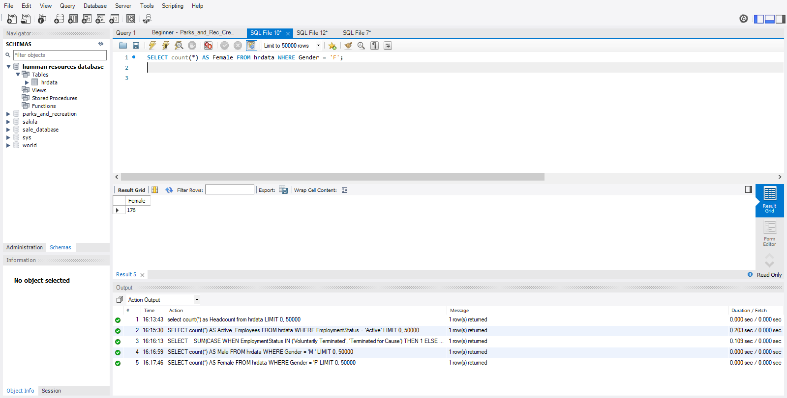

# HR Dashboard – Excel

An interactive Human Resources dashboard built with Microsoft Excel to provide insights into workforce performance, demographics, recruitment trends, and employee engagement.

---

##  Table of Contents
- [ Objective](#-objective)
- [ Data Source](#-data-source)
- [ Design](#-design)
- [ Tools](#-tools)
- [⚙ Development](#️-development)
  - [ Data Exploration](#-data-exploration)
  - [ Data Cleaning](#-data-cleaning)
  - [ Data Transformation](#-data-transformation)
  - [ SQL View Creation](#-sql-view-creation)
- [ Visualization](#-visualization)
- [ Conclusion](#-conclusion)

---

### Objective

**Main Goal:**  
To equip the HR department with actionable insights into:
- Workforce demographics  
- Employee satisfaction  
- Recruitment sources  
- Retention trends  

**Ideal Solution:**  
A dashboard that visualizes key HR metrics, including:
-  Employee Count by Department & State  
-  Gender Breakdown  
-  Department-Wise Distribution  
-  Marital Status Distribution  
-  Recruitment Source Insights  
-  Satisfaction Levels  
-  Employment Status (Active vs Terminated)  

---

##  User Story

> As the Head of Human Resources, I want to use the HR dashboard to monitor employee performance and satisfaction.  
> This dashboard helps me identify top-performing departments, high-turnover segments, and satisfaction trends.  
> With these insights, I can reward teams, provide support, and improve employee retention and engagement.

---

### Design Stages
-  Design
-  Development
-  Testing
-  Analysis

---

### Tools

| Tool         | Purpose                                         |
|--------------|--------------------------------------------------|
| Excel        | Data exploration & dashboard visualization      |
| SQL Server   | Data cleaning, shaping, and querying            |
| GitHub       | Version control and project documentation       |

---

## ⚙️ Development

### 🔍 Data Exploration
Explored the dataset in Excel for:
- Inconsistencies and missing values
- Bugs or unusual characters
- Understanding column relationships

Initial insights:
- 12+ relevant columns
- Dataset is larger than needed

---

### 🧹 Data Cleaning

**Goals:**
- Keep only relevant columns
- Clean text and remove nulls
- Convert codes to readable labels

| Property         | Description     |
|------------------|-----------------|
| Rows             | 312             |
| Columns          | 16              |

**Steps Taken:**
1. Dropped unnecessary columns  
2. Merged "Voluntarily Terminated" & "Terminated for Cause" as "Terminated"  
3. Renamed columns  
4. Converted `M` → `Male`, `F` → `Female`  
5. Translated satisfaction scores:  
   `1 = Very Low` to `5 = Very High`

---

###  Data Transformation 

## Analyze key Indicators 
### SQL query 
```sql

-- Total Employees
SELECT COUNT(*) AS Headcount FROM hrdata

-- Active Employees
SELECT COUNT(*) AS Active_Employees FROM hrdata WHERE EmploymentStatus = 'Active'

-- Terminated Employees
SELECT SUM(CASE WHEN EmploymentStatus IN ('Voluntarily Terminated', 'Terminated for Cause') THEN 1 ELSE 0 END) AS Terminated_Employee FROM hrdata

-- 4) Total Male Employee: SELECT COUNT(*) AS Male FROM hrdata WHERE Gender = 'M'

-- 5) Total Female Employee: SELECT COUNT(*) AS Female FROM hrdata WHERE Gender = 'F'

CHARTS RQUIREMENT

We would like to visualize various aspects of our pizza sales data to gain insights and understand key trends. We have identified the following requirements for creating charts:

-- Gender Breakdown
SELECT Gender, COUNT(*) FROM hrdata GROUP BY Gender

-- Recruitment Source
SELECT RecruitmentSource, COUNT(*) AS Total_Employees FROM hrdata GROUP BY RecruitmentSource

-- Department Distribution
SELECT Department, COUNT(*) AS Total_Employees FROM hrdata GROUP BY Department

-- Marital Status
SELECT MaritalStatus, COUNT(*) AS Total_Employees FROM hrdata GROUP BY MaritalStatus

-- Satisfaction Levels
SELECT 
  CASE EmployeeSatisfaction
    WHEN 1 THEN 'Very Low'
    WHEN 2 THEN 'Low'
    WHEN 3 THEN 'Acceptable'
    WHEN 4 THEN 'High'
    WHEN 5 THEN 'Very High'
    ELSE 'Unknown'
  END AS Satisfaction_Level,
  COUNT(*) AS Total_Employees
FROM hrdata
GROUP BY Satisfaction_Level

```
# TOTAL_EMPLOYEE

#  Active Employees

# TERMIANTED_EMPLOYEE

# MALE_EMPLOYEE

#  FEMALE_EMPLOYEE 


# Visualization 


## Results

- What does the dashboard look like?


###  Conclusion

###  Key Findings

###  Gender Breakdown
- 43% Male / 57% Female  
- IT/IS mostly male, Production mostly female  

####  Department Distribution
- **Top 3 Departments:**  
  - Production  
  - IT/IS  
  - Sales  
- These departments drive core company functions  

####  Marital Status
- High number of Singles and Marrieds  

####  Recruitment Sources
- Majority from **Indeed**, followed by **LinkedIn**  
- Indeed hires show better performance  

####  Satisfaction Levels
- Most employees fall into **“Acceptable”**  
- Some departments with high workload scored **“Low”**  

####  Employment Status
- 67% **Active** / 33% **Terminated**


